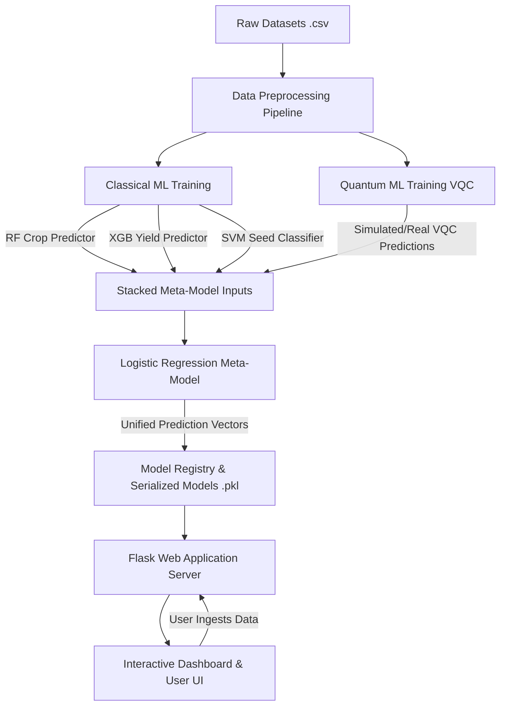

# 🌾 SeedIQ - Quantum-Powered Agricultural Intelligence System

SeedIQ is a full-stack, AI-powered agricultural decision-support platform. It integrates classical Machine Learning algorithms (Random Forest, XGBoost, Support Vector Machines) and Quantum Machine Learning (Qiskit-based Variational Quantum Classifiers) into a unified ensemble (Logistic Regression Meta-Model) to deliver high-accuracy recommendations for crops, yields, seed viability, and optimal storage preservation.

---

## 🏗️ System Architecture & Workflow

The platform operates via a multi-layered architecture:



### 1. Data Ingestion & Preprocessing
Users upload agricultural datasets (e.g., CSV files containing soil chemistry, crop yields, seed weights) via the web interface. The system drops missing values, scale features using `StandardScaler`, and encodes categorical features using `LabelEncoder`.

### 2. Model Stacking & Ensemble Pipeline
SeedIQ does not rely on a single model. It generates predictions from individual models, normalize them, stack them into feature columns, and feeds them to an overarching **Logistic Regression Meta-Model**. This architecture aligns classical and quantum predictions to achieve maximum classification accuracy.

---

## 📂 File-by-File Breakdown

### 🛠️ Root Level Scripts
- **[app.py](file:///c:/Users/SUMITH%20R/Desktop/SeedIQ/app.py)**
  The core Flask application. It defines server routes, manages SQLite database connection for user authentication, loads model binaries (`.pkl`) from the `models/` directory, handles dataset uploads, and executes inference code for the forms (Crop, Yield, Seed, Storage).
- **[train_all_models.py](file:///c:/Users/SUMITH%20R/Desktop/SeedIQ/train_all_models.py)**
  The central automated training pipeline script. It reads available training datasets from the `data/` folder, trains the models (Random Forest, XGBoost, SVM), simulates or runs the Quantum VQC component, builds the prediction stack, trains the Meta-Model, and saves the binary files into `models/`. It updates both the plain-text `training_history.txt` log and the structured `training_registry.json`.
- **[data_preprocessing.py](file:///c:/Users/SUMITH%20R/Desktop/SeedIQ/data_preprocessing.py)**
  Utility functions for reading raw CSV datasets, cleaning null values, encoding categories, scaling numeric dimensions, and returning pre-split train/test vectors.
- **[crop_prediction_model.py](file:///c:/Users/SUMITH%20R/Desktop/SeedIQ/crop_prediction_model.py)**
  Helper functions to compile, fit, and make predictions using the classical Random Forest classifier for crop matching.
- **[yield_prediction_model.py](file:///c:/Users/SUMITH%20R/Desktop/SeedIQ/yield_prediction_model.py)**
  Helper functions to compile, fit, and predict crop yield using the XGBoost regressor.
- **[seed_classification.py](file:///c:/Users/SUMITH%20R/Desktop/SeedIQ/seed_classification.py)**
  Helper functions to compile, fit, and predict viability (viable/non-viable) using a Support Vector Machine classifier.
- **[qml_model.py](file:///c:/Users/SUMITH%20R/Desktop/SeedIQ/qml_model.py)**
  Contains a 2-qubit Quantum Circuit implemented in PennyLane using `RY` feature maps and `RZ` parameters for expectations measurements.
- **[storage_recommendation.py](file:///c:/Users/SUMITH%20R/Desktop/SeedIQ/storage_recommendation.py)**
  Rule-based logic engine to evaluate temperature and humidity bounds and provide storage recommendations.
- **[main.py](file:///c:/Users/SUMITH%20R/Desktop/SeedIQ/main.py)**
  Command-line entrypoint script that demonstrates preprocessing, model training, and sample inference.
- **[requirements.txt](file:///c:/Users/SUMITH%20R/Desktop/SeedIQ/requirements.txt)**
  List of Python libraries required to run the application (Flask, scikit-learn, xgboost, qiskit, qiskit-machine-learning, pennylane, etc.).
- **[training_history.txt](file:///c:/Users/SUMITH%20R/Desktop/SeedIQ/training_history.txt)**
  Auto-generated log file tracking the history of model executions, sizes, shapes, and metrics.
- **[training_registry.json](file:///c:/Users/SUMITH%20R/Desktop/SeedIQ/training_registry.json)**
  Structured database cataloging metadata of trained models (dataset used, parameters, accuracies, timestamps) for downstream feeding.

---

### 📦 Datasets (`data/`)
- **[merged_ml_dataset.csv](file:///c:/Users/SUMITH%20R/Desktop/SeedIQ/data/merged_ml_dataset.csv)**: 100 sample records containing Nitrogen, Phosphorus, Potassium, Temperature, Humidity, pH, and Rainfall for Crop recommendations.
- **[crop_production_karnataka.csv](file:///c:/Users/SUMITH%20R/Desktop/SeedIQ/data/crop_production_karnataka.csv)**: 100 sample records containing Crop, Season, Area (Hectares), and Yield (Tonnes).
- **[seed_viability_data.csv](file:///c:/Users/SUMITH%20R/Desktop/SeedIQ/data/seed_viability_data.csv)**: 100 sample records tracking seed Moisture level, Weight (g), and Viability.

---

### 🌐 Templates (`templates/`)
- **[base.html](file:///c:/Users/SUMITH%20R/Desktop/SeedIQ/templates/base.html)**: Global layout containing HTML headers, Google Font configurations, Bootstrap CSS imports, dynamic alert messages, and the primary navigation header.
- **[login.html](file:///c:/Users/SUMITH%20R/Desktop/SeedIQ/templates/login.html)** & **[register.html](file:///c:/Users/SUMITH%20R/Desktop/SeedIQ/templates/register.html)**: UI cards with dark glassmorphism effects for authentication.
- **[dashboard.html](file:///c:/Users/SUMITH%20R/Desktop/SeedIQ/templates/dashboard.html)**: Central hub showing model comparison charts, model accuracy metrics, and quick actions to access crop, yield, seed modules, or export reports to PDF.
- **[upload.html](file:///c:/Users/SUMITH%20R/Desktop/SeedIQ/templates/upload.html)**: Standard page allowing users to upload CSV data files.
- **[crop_recommendation.html](file:///c:/Users/SUMITH%20R/Desktop/SeedIQ/templates/crop_recommendation.html)**: Soil values input form to recommend crops.
- **[yield_prediction.html](file:///c:/Users/SUMITH%20R/Desktop/SeedIQ/templates/yield_prediction.html)**: Input parameters form (Crop, Season, Area) to forecast yields.
- **[seed_viability.html](file:///c:/Users/SUMITH%20R/Desktop/SeedIQ/templates/seed_viability.html)**: Seed measurements input form to predict seed viability.
- **[storage_recommendation.html](file:///c:/Users/SUMITH%20R/Desktop/SeedIQ/templates/storage_recommendation.html)**: Crop selectors form displaying preservation configurations.
- **[quantum_ml.html](file:///c:/Users/SUMITH%20R/Desktop/SeedIQ/templates/quantum_ml.html)**: Explainer screen describing Quantum Machine Learning, Hilbert Spaces, Ansatz, and the Variational Quantum Classifier (VQC) workflow.

---

### 🔬 Notebooks (`notebooks/`)
- **[1_Data_Preprocessing.py](file:///c:/Users/SUMITH%20R/Desktop/SeedIQ/notebooks/1_Data_Preprocessing.py)**: Python cells to generate raw dummy databases if missing.
- **[2_Classical_ML_Training.py](file:///c:/Users/SUMITH%20R/Desktop/SeedIQ/notebooks/2_Classical_ML_Training.py)**: Cells showing standard training of classical ML algorithms.
- **[3_Quantum_ML_Training.py](file:///c:/Users/SUMITH%20R/Desktop/SeedIQ/notebooks/3_Quantum_ML_Training.py)**: Cloud-based Qiskit training cell that initializes and trains the VQC model.

---

## 🏋️ How to Run Model Training

You can train the models in two ways:

### Method A: Single Command Training Pipeline (Local Environment)
If you want to train all classical models, run simulated quantum predictions, compile the meta-model, and export everything automatically:
1. Ensure dependencies are installed:
   ```bash
   pip install -r requirements.txt
   ```
2. Execute the training script:
   ```bash
   python train_all_models.py
   ```
3. The script will look for training files in `data/`, train the models, save model files to `models/`, append to `training_history.txt`, and save JSON metadata to `training_registry.json`.

### Method B: Google Colab Training Pipeline (Cloud Environment)
To run in Google Colab (recommended if you want to use real IBM Quantum simulators without local setup overhead):
1. Copy the code from **[1_Data_Preprocessing.py](file:///c:/Users/SUMITH%20R/Desktop/SeedIQ/notebooks/1_Data_Preprocessing.py)** to generate and scale inputs.
2. Install Qiskit inside Colab:
   ```python
   !pip install qiskit qiskit-machine-learning
   ```
3. Run **[2_Classical_ML_Training.py](file:///c:/Users/SUMITH%20R/Desktop/SeedIQ/notebooks/2_Classical_ML_Training.py)** and **[3_Quantum_ML_Training.py](file:///c:/Users/SUMITH%20R/Desktop/SeedIQ/notebooks/3_Quantum_ML_Training.py)** inside cells.
4. Download the generated `.pkl` binaries (`rf_model.pkl`, `xgb_model.pkl`, `svm_model.pkl`, `vqc_model.pkl`, `meta_model.pkl`) and save them under `models/` directory in the local repository.

---

## 🚀 Next Steps / Recommendations for Improvement

1. **Replace Quantum Mocking with Full Implementations:**
   Implement a fallback wrapper in the Flask backend that dynamically routes inputs to the Qiskit VQC model (`vqc_model.pkl`) if Qiskit is available.
2. **Correct Yield Prediction Features Mapping:**
   Currently, `app.py` makes yield predictions by passing `np.array([[area, 1, 1]])` (hardcoded categorical features). In production, map the Season and Crop fields from the UI form into their corresponding one-hot encoded or label encoded indexes used during training.
3. **Database Integration:**
   Migrate user records and prediction history from SQLite to MongoDB (since `requirements.txt` already references `Flask-PyMongo` and `pymongo`).
4. **Deploy real-time training on Web Dashboard:**
   Create an admin portal route in `app.py` that allows clicking a button to trigger `train_all_models.py` directly from the dashboard, displaying live training logs in the UI.
